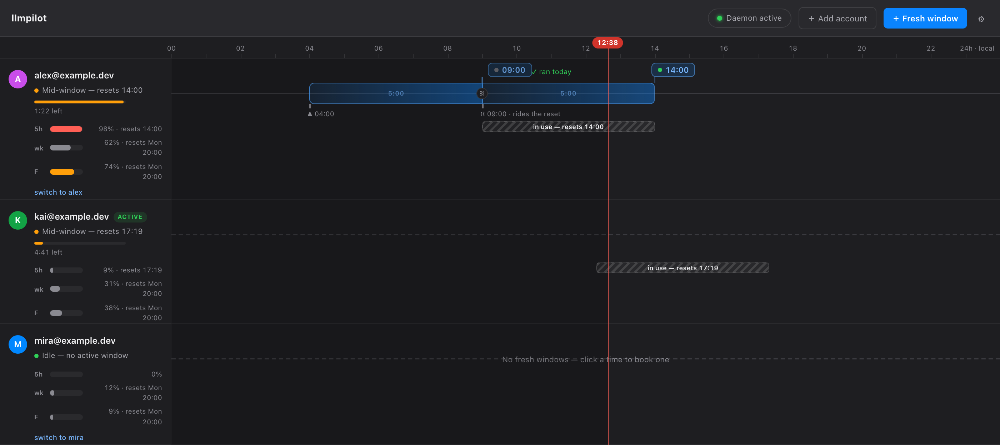

# llmpilot

**your Claude accounts, on autopilot** — a multi-account companion for Claude Code on macOS.

```sh
brew install alicicek/tap/llmpilot        # the CLI + daemon
brew install --cask alicicek/tap/llmpilot # the menu bar app
```

[](https://github.com/alicicek/llmpilot/actions/workflows/ci.yml)
[](https://github.com/alicicek/llmpilot/releases)
[](LICENSE)


One daemon watches every account's real usage, keeps idle logins fresh, switches
to the account with headroom before you hit a wall, and starts your 5-hour
windows on schedule. Five thin surfaces over one brain: a native menu bar app, a
local cockpit, a statusline, a CLI, and the autopilot itself.

Built for people who run more than one Claude Max plan and are tired of the
`/login` dance, guessing which account has room left, and waking up to windows
that never opened.

Core is free forever, MIT-licensed. The autopilot is [Pro](#free-and-pro) —
a one-time £9.99 / $12.99, not a subscription.



## What it does

- **See every account at a glance.** Live usage for all your accounts — 5-hour,
  weekly, and per-model buckets — read straight from Anthropic's usage endpoint
  with an honest "as of" timestamp. Idle accounts stay fresh, so the dashboard
  never goes blind on the account you're about to switch to.
- **Switch before the wall.** When the account you're on runs low, llmpilot
  switches you to one with headroom and tells you after — switch first, notify
  second. Credential writes are lock-first and backed up, so a switch never
  corrupts a login.
- **Start windows on time.** Schedule a fresh 5-hour window to open at a set
  time on a chosen account, so your overnight or early-morning capacity isn't
  wasted. It only *starts* a window; it never advances one you're already in.
- **Read it anywhere.** The same live state renders in the menu bar, a local
  cockpit window, a Claude Code statusline, and `llmpilot status`.


## How it works

llmpilot is one Go binary. The **daemon** polls each account's usage (no more
than once every 5 minutes per account, backing off on rate limits), caches
percentages and reset times locally, and drives the autopilot. Every surface —
menu bar, cockpit, statusline, CLI — reads that one daemon over a loopback
socket. Nothing is duplicated, nothing disagrees.

Credentials are Claude Code's own. llmpilot reads and writes the macOS Keychain
item Claude Code already uses, under Claude Code's own lock files, so it
cooperates with a running `claude` session instead of racing it.

The first Keychain read from a freshly built binary triggers one macOS prompt —
click **Always Allow** to grant that binary persistent access. Homebrew installs
a stable binary path, so the grant sticks; if you build from source, use
`make build` rather than `go run` for the same reason.

## Free and Pro

Core is **free forever**, MIT-licensed, and does the whole read side: live usage
for every account, manual switching, the cockpit, the statusline, and analytics.

**Pro** adds the autopilot — automatic switching before the wall, window
scheduling, and waking the Mac for scheduled starts. It is a one-time purchase
(£9.99 / $12.99), not a subscription.

Official signed builds include Pro; builds you compile from source are the free
app. The split is stated here on day one so nothing gets pulled out from under
you later.

## Privacy and security

- **Your tokens never leave your machine.** llmpilot talks only to Anthropic's
  own endpoints (the same ones Claude Code uses) and, for Pro, a licensing
  worker that never sees a Claude token.
- **No telemetry, ever.** Cache files hold usage percentages and reset
  timestamps only — never tokens.
- **One optional network check:** a GET-only version check. Turn it off with
  `LLMPILOT_NO_UPDATE_CHECK=1`.

See [SECURITY.md](SECURITY.md) for the full model and how to report a
vulnerability.

## A note on Anthropic's terms

llmpilot uses the OAuth credential Claude Code stores on your Mac. Anthropic's
policy (as of February 2026) limits that credential to *"ordinary use of Claude
Code and native Anthropic applications."* The ban on using it *"on behalf of
their users"* is aimed at hosted SaaS proxies; a local, personal tool like this
is not addressed either way. Running several Max plans and switching between them
is not explicitly prohibited, but it lives in a gray zone, and some multi-account
users have reported automated account actions. llmpilot never sends your
credentials anywhere — but you should decide, informed, whether this fits your
use. The [FAQ](docs/FAQ.md) has the full picture.

## Develop

```sh
make build   # go build -o ./llmpilot ./cmd/llmpilot
make test    # go test ./...
make lint    # golangci-lint run
make check   # all of the above
```

See [CONTRIBUTING.md](CONTRIBUTING.md) for the open-core layout and conventions.

## Documentation

- [FAQ](docs/FAQ.md) — install, the Anthropic terms, wake limitations, the
  undocumented usage endpoint, and what happens if a plan changes.
- [SECURITY.md](SECURITY.md) — security model and disclosure.
- [CONTRIBUTING.md](CONTRIBUTING.md) — build, test, and how the open-core split
  is laid out.

## License

MIT — see [LICENSE](LICENSE). The source in this repository is yours under MIT;
the "llmpilot" name and the official signed builds are the maintainer's.
